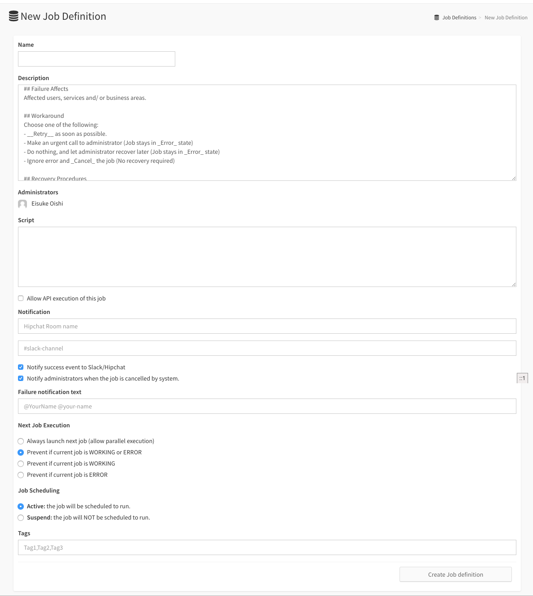
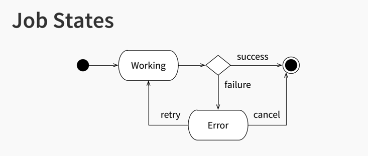

# User Guide

## How to define a job?

### 1. Access the kuroko2 web console.

### 2. Click on "Create new" link within left sidebar.

### 3. Fill in the form:

- Name ... The name of the job.
- Description ... A description of the job.
- Script ... Definition of a workflow, will be explained later.
- Slack channel / Hipchat room ... A chat room to send a message.
- Next Job Execution ... Check if you want to prevent multiple instances of same jobs.




### 4. Click the "Create Job definition" button.


## Job Scheduling

1. Visit the job definition details.
2. Enter a value in the format of a cron command in the job schedules field.
3. Click "Add Schedule".


[note] Job Suspend Schedules is schedules that suspend scheduled jobs.

## Job Script

### DSL

Kuroko2 has a DSL for defining a custom workflow. Here is a basic example:

```
# This is a single line comment
env: DRY_RUN=1
execute: echo 'Hello'
```

the `execute` task launches specified command. Workflow engine executes next line if it succeeded or stop the workflow if it failed.
For more information, see [tasks.md](tasks.md) and [Defining Workflow](#defining-workflow) section.

### Defining Workflow

#### bundle tasks in one job definitions.

Doing tasks by sequencial.

```
my_project_runner: MyProject::Task1.run
my_project_runner: MyProject::Task2.run
```

when error occurs, the job stops and we can choose Cancel or Skip or Retry.

 Action | Description
--------|------------------------------------------------------------------------------------------------------------------------------
 Cancel | Stop all steps in the job.
 Retry  | Execute from failed step.
 Skip   | Ignore the failed step and execute from next step.


## Job Status Flow



 Status | Description
--------|------------------------------------------------------------------------------
WORKING | A job is working.
ERROR   | Your tasks finished with non-zero exit status.
SUCCESS | Your tasks finished with the zero exit status (final state)
CANCEL  | Press the cancel button or prevent running by kuroko2 system. (final state)

## Next Job Execution

* Always launch next job (allow parallel execution)
* Prevent if current job is WORKING or ERROR
* Prevent if current job is WORKING
* Prevent if current job is ERROR

[note] "ERROR" is not a final state. You should cancel or retry "ERROR" state jobs. If your "ERROR" state job don't need treat carefully, you may want to add a `auto_skip_error` task in your job script.

## Notification

TODO

## Environment Variables

  Environment variable      | ex.
----------------------------|----------------------------------
KUROKO2_JOB_DEFINITION_ID   | "137"
KUROKO2_JOB_DEFINITION_NAME | "My daily job sample"
KUROKO2_LAUNCHED_TIME       | "2016-04-20T16:29:57.302+09:00"
KUROKO2_JOB_INSTANCE_ID     | "100"

* those environment variables kept same value until the job reaches to final("SUCCESS" or "CANCEL") state.

## Execution Logs

TODO
